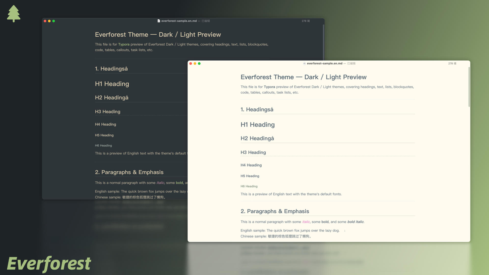
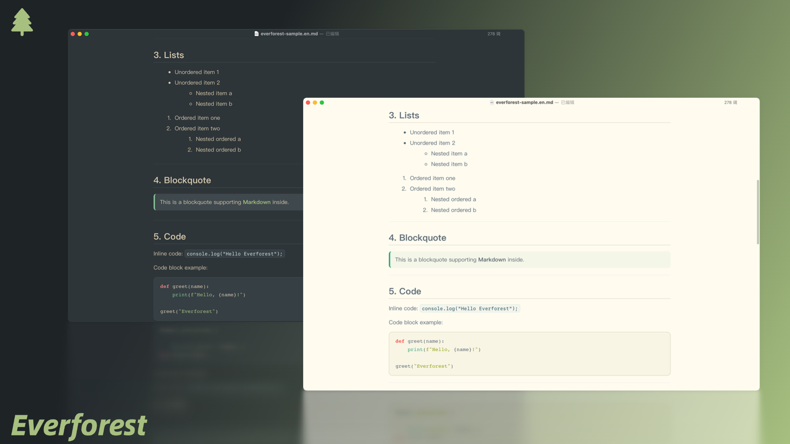
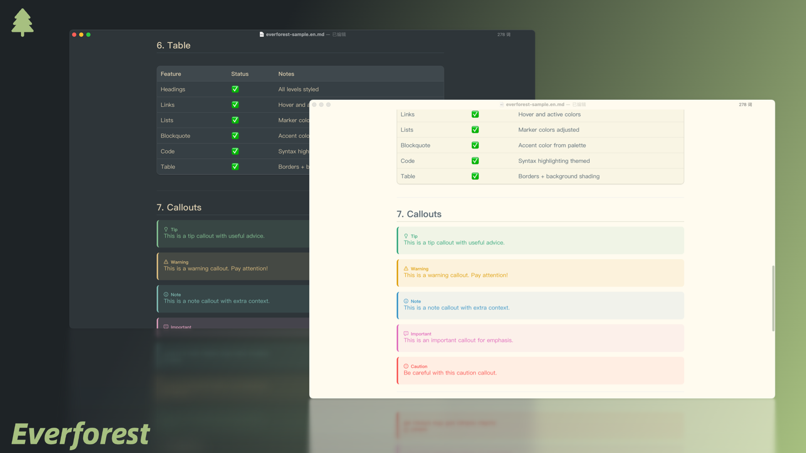
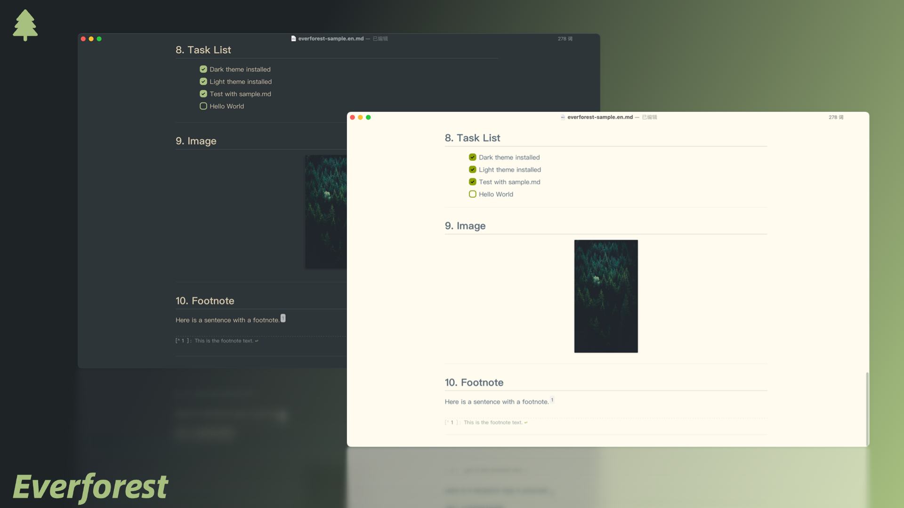

# Everforest Theme for Typora

A clean, nature-inspired theme for Typora, based on [Everforest](https://everforest.vercel.app/) color palette. Designed to be easy on the eyes for long writing sessions, with balanced contrast and harmonious colors.

#### Available Options

- Everforest Light
- Everforest Dark

## Screenshots

## Installation

1. **Download the theme files**
   [Everforest Theme for Typora – Download](https://github.com/EthanBao27/everforest-typora/tree/main/themes)

2. **Locate Typora’s theme folder**

   - Open Typora → Preferences → Appearance → Open Theme Folder.

3. **Copy theme files**

   - Place the everforest.css file and its resources into the theme folder.

4. **Apply the theme**

   - Restart Typora, then select **Everforest** from the Themes menu.

## Author

**Ethan Bao**
GitHub: [EthanBao27](https://github.com/EthanBao27)

## Links

- **Homepage:** [Everforest Typora Theme Repository](https://github.com/EthanBao27/everforest-typora)
- **Download:** [Everforest Typora Theme – themes folder](https://github.com/EthanBao27/everforest-typora/tree/main/themes)
